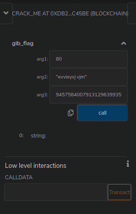
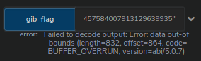
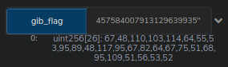

# crackme.sol

This one almost *cracked me* (get it?), but I'll get to why later. We are given a crack me:

```solidity
pragma solidity ^0.6.0;

contract crack_me{

    function gib_flag(uint arg1, string memory arg2, uint arg3) public view returns (uint[]){
        //arg3 is a overflow
        require(arg3 > 0, "positive nums only baby");
        if ((arg1 ^ 0x70) == 20) {
            if(keccak256(bytes(decrypt(arg2))) == keccak256(bytes("offshift ftw"))) {
                uint256 check3 = arg3 + 1;
                if( check3< 1) {
                    return flag;
                }
            }
        }
        return "you lost babe";
    }

    function decrypt(string memory encrypted_text) private pure returns (string memory){
        uint256 length = bytes(encrypted_text).length;
        for (uint i = 0; i < length; i++) {
            byte char = bytes(encrypted_text)[i];
            assembly {
                char := byte(0,char)
                if and(gt(char,0x60), lt(char,0x6E))
                { char:= add(0x7B, sub(char,0x61)) }
                if iszero(eq(char, 0x20))
                {mstore8(add(add(encrypted_text,0x20), mul(i,1)), sub(char,16))}
            }
        }
        return encrypted_text;
    }
}
```

When we put this code in Remix, we immediately notice it does not compile.
So we whip up real quick to make it compile, like changing the output to `string memory` and make the flag variable a `string`. Like this:

```solidity
function gib_flag(uint arg1, string memory arg2, uint arg3) public view returns (string memory){
    //arg3 is a overflow
    require(arg3 > 0, "positive nums only baby");
    if ((arg1 ^ 0x70) == 20) {
        if(keccak256(bytes(decrypt(arg2))) == keccak256(bytes("offshift ftw"))) {
            uint256 check3 = arg3 + 1;
            if (check3 < 1) {
                return "flag";
            }
        }
    }
    return "you lost babe";
}
```

Let's start reversing. We can start by the `gib_flag` function.
It takes three arguments: `uint arg1`, `string memory arg2`, `uint arg3`.

Line by line we read straight away:

```solidity
//arg3 is a overflow
require(arg3 > 0, "positive nums only baby");
```

So the author told us what to do and we can check that it is an overflow in the last check:

```
uint256 check3 = arg3 + 1;
if (check3 < 1) {
    return "flag";
}
```

So `arg3` must be `2 ** 256 - 1`.
Moving on to the remaining arguments, we see that `arg1 ^ 0x70` must be equal to `20`.
This is also easy, we have `a ^ b = c` where we know `b` and `c`, so we XOR them together and get the result.
`0x70 ^ 0x20 = 80`, `arg1` is done.

Moving on to the last and most difficult.
I started reversing it by hand and noticed it was some kind of Caesar cipher.
But then I noticed I could fairly easy manipulate the characters one by one and crack it that way.

Since the decrypt function was private, I copied the code to a separate contract, deployed it started experimenting.
You can access it here (`0x71018b714767d056edBcf788bb8494AEE2e129f4`).

```solidity
contract helper {
    function decrypt(string memory encrypted_text) public pure returns (string memory){
        uint256 length = bytes(encrypted_text).length;
        for (uint i = 0; i < length; i++) {
            byte char = bytes(encrypted_text)[i];
            assembly {
                char := byte(0,char)
                if and(gt(char,0x60), lt(char,0x6E))
                { char:= add(0x7B, sub(char,0x61)) }
                if iszero(eq(char, 0x20))
                {mstore8(add(add(encrypted_text,0x20), mul(i,1)), sub(char,16))}
            }
        }
        return encrypted_text;
    }
}
```

While I did it the dumb way, the smart way was noticing the shift would wrap around for lowercase letters,
see that it was a ROT16 cipher and go to CyberChef <https://gchq.github.io/CyberChef/#recipe=ROT13(true,true,16)&input=b2Zmc2hpZnQgZnR3> to find that `arg2` is `evvixyvj vjm`.

We have our ingredients to lets try to get the flag.
Add the address of the contract as we did with the first contract,
get the small window on remix and send:



So what happened? Remember how we switched the function signature to `string`?
That's the problem (the start). Let us change it back to `uint[]`, keep the `memory` and replace the strings with `new(uint[])`.
Use the `At Address` again and retry.



> So what now?

See the problem is we did not give a size for the flag.
The array must have a size in the return function.
Give it one like `256`, make sure there is enough space!

About the return value, create a variable like `uint256[256] memory f` and just return that.



I'll drop the charade now, the correct size is `26`.
How did I figure it out? By starting at `1` and changing incrementally.

```python
flag = [67,48,110,103,114,64,55,53,95,89,48,117,95,67,82,64,67,75,51,68,95,109,51,56,53,52]
print("".join(map(chr, flag))
> 'C0ngr@75_Y0u_CR@CK3D_m3854'
```

How could you know the array size?
You could decompile the code and notice the `while idx < 26` there.

## Cheeky Way

Just like the first, decompile and look at the code (<https://rinkeby.etherscan.io/bytecode-decompiler?a=0xdb2f21c03efb692b65fee7c4b5d7614531dc45be>).

You'll notice this block of code:
```
mem[_40] = 51
mem[_40 + 32] = 64
mem[_40 + 64] = 30
mem[_40 + 96] = 23
mem[_40 + 128] = 2
mem[_40 + 160] = 48
mem[_40 + 192] = 71
mem[_40 + 224] = 69
mem[_40 + 256] = 47
mem[_40 + 288] = 41
mem[_40 + 320] = 64
mem[_40 + 352] = 5
mem[_40 + 384] = 47
mem[_40 + 416] = 51
mem[_40 + 448] = 34
mem[_40 + 480] = 48
mem[_40 + 512] = 51
mem[_40 + 544] = 59
mem[_40 + 576] = 67
mem[_40 + 608] = 52
mem[_40 + 640] = 47
mem[_40 + 672] = 29
mem[_40 + 704] = 67
mem[_40 + 736] = 72
mem[_40 + 768] = 69
mem[_40 + 800] = 68
```

Followed by `mem[(32 * idx) + _35] = uint8(112 xor mem[(32 * idx) + _40])`. So we can just.

```python
enc_flag = [51,64,30,23,2,48,71,69,47,41,64,5,47,51,34,48,51,59,67,52,47,29,67,72,69,68]
print("".join([chr(c ^ 112) for c in enc_flag]))
> 'C0ngr@75_Y0u_CR@CK3D_m3854'
```

Easy.