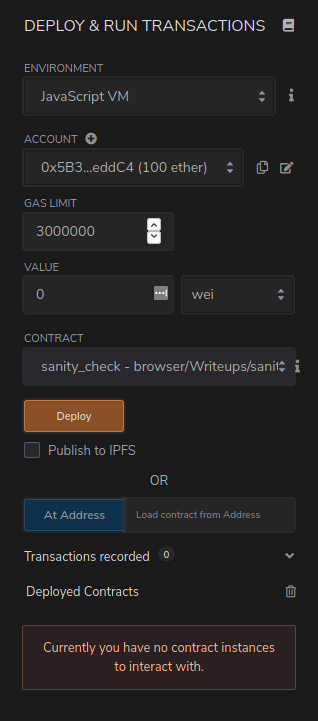
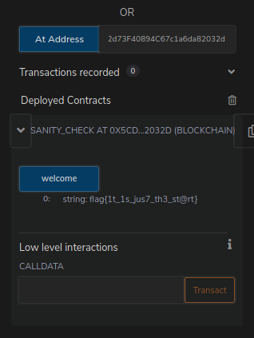

# sanity check

We were given an address (`0x5CDd53b4dFe8AE92d73F40894C67c1a6da82032d`) and a contract which is fairly simple:

```solidity
pragma solidity ^0.7.0;
//SPDX-License-Identifier: UNLICENSED

contract sanity_check {
    function welcome() public pure returns (string memory){
        return "flag{}";
    }
}
```

We just need to call the contract and get the flag.
To do so we can setup an elaborate JS environment with truffle and friends,
or we can use the Remix IDE (https://remix.ethereum.org/).

Create a file and put the contract source there.
Once compiled, the *Deploy & Run Transactions* tab should look like this:



Adding the challenge address to that *At Address* and clicking on it should add a new contract to the *Deployed Contracts* below.
Click on the `welcome` function, the flag should appear.



> If nothing appears, try to reload the page. Remix can be a bit temperamental.

## Cheeky Way

Search for the contract on Etherscan, decompile it, get the flag.

<https://rinkeby.etherscan.io/bytecode-decompiler?a=0x5cdd53b4dfe8ae92d73f40894c67c1a6da82032d>