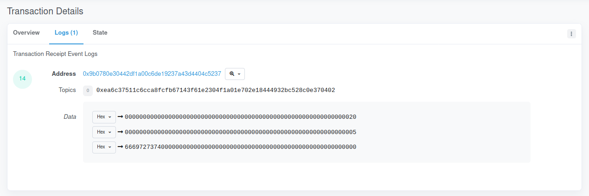
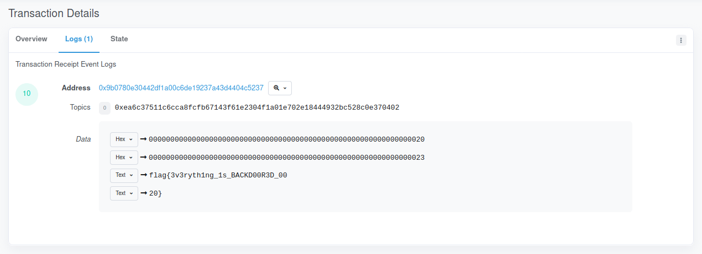

# secure_enclave

For this challenges we were given a "secure" enclave.
In this case, a wallet owner can set a secret and only the owner can read it back.

```solidity
pragma solidity ^0.6.0;

contract secure_enclave {
    event pushhh(string alert_text);

    struct Secret {
        address owner;
        string secret_text;
    }

    mapping(address => Secret) private secrets;

    function set_secret(string memory text) public {
        secrets[msg.sender] = Secret(msg.sender, text);
        emit pushhh(text);
    }

    function get_secret() public view returns (string memory){
        return secrets[msg.sender].secret_text;
    }
}
```

To achieve this, the contract uses that `mapping` which is a map between addresses and `Secret`.
So our only option to retrieve the secret would be to guess the flag's owner address and pretend to be them.
That does not sound easy, and it is not even possible without getting access to the original wallet.

However, whenever a secret is stored a message is emitted.
Emitted events are stored in the transactions logs, they are used as debug and auditing tools.
Since they are stored in the logs, and logs are permanent, sensitive information should not be logged.

> Read more about events in <https://docs.soliditylang.org/en/v0.8.0/contracts.html#events>.

Notice how whenever a secret is set, an event is emitted.
This means that at a given time the flag was probably logged, we just need to retrieve it.
To do so we search for the challenge address (`0x9B0780E30442df1A00C6de19237a43d4404C5237`) in <https://rinkeby.etherscan.io/>.

> Etherscan is where you can search for transactions, wallets and more. If it has an address, it is probably there.

Going back to the start of transactions in <https://rinkeby.etherscan.io/txs?a=0x9B0780E30442df1A00C6de19237a43d4404C5237>
shows us a series of transactions from the same account that issued the contract. Bingo.
We just need to search the logs one by one until we get the flag.

For example: The first transaction stored the value `first`.




> To convert from hexadecimal to text, select the menu on the numbers left and select `Number`.


